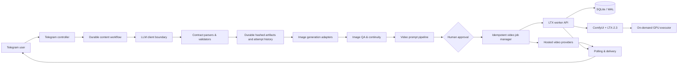

# AI Content Factory


**Telegram-first, human-in-the-loop platform for producing short AI videos.** It coordinates role-specialized LLM stages, validates machine-readable production contracts, generates and reviews visual assets, and submits paid video jobs through duplicate-spend guards, manual reconciliation, and a cost-aware GPU worker.

> **Portfolio-safe snapshot.** This public repository was rebuilt from a reviewed source snapshot with a new Git history. Credentials, user conversations, production state, personal workspaces, infrastructure addresses, and private operational reports are intentionally excluded. Personal role labels were replaced with the synthetic `owner` and `partner` roles.

[Русское описание](docs/README.ru.md) · [Architecture](docs/ARCHITECTURE.md) · [Demo walkthrough](docs/DEMO.md) · [Evaluation](docs/EVALUATION.md) · [Security](docs/SECURITY.md)

## Why this is more than an API wrapper

A content run is a durable workflow rather than a single prompt:

```text
idea → brief → script → storyboard → image contracts → visual QA
     → reference assets → scene frames → post-image QA → video prompts
     → human approval → provider submission → polling → Telegram delivery
```

The core engineering constraints are explicit:

- **Structured LLM output:** scene, visual-bible, and image-prompt contracts are parsed and validated before downstream work.
- **Human approval gates:** semantic stages remain reviewable; paid submission is approval-gated and irreversible once accepted by a provider.
- **Duplicate-spend guards:** provider submissions are fingerprinted and persisted before external POST requests; ambiguous outcomes require reconciliation.
- **Ambiguous-result safety:** uncertain submissions are blocked for reconciliation instead of being retried blindly.
- **Multimodal continuity:** character/reference assets and scene metadata are carried through image and video stages.
- **Durable GPU jobs:** the LTX worker uses SQLite/WAL, deterministic job IDs, authenticated HTTP, restart recovery, and cleanup attempts whose failures are surfaced.
- **Cost-aware infrastructure:** the remote executor wakes a GPU VM on demand and attempts shelving in `finally` paths.

## Architecture



See [docs/ARCHITECTURE.md](docs/ARCHITECTURE.md) for component boundaries, state ownership, failure handling, and trust boundaries.

## Repository map

```text
agent_platform/             Telegram UX, LLM boundary, workflow and providers
ltx_worker/                 Authenticated LTX/ComfyUI worker and GPU lifecycle
ltx_worker/assets/          Version-pinned workflow and runtime manifests
tests/                      Provider-free unit and regression tests
scripts/security_scan.py    Portfolio privacy and secret gate
docs/                       Architecture, demo, evaluation and limitations
```

## Provider boundaries

| Capability | Implemented adapters | Default behavior |
|---|---|---|
| Text/vision reasoning | Codex CLI client behind an `LlmClient` protocol | Requires local Codex authentication |
| Images | Codex image tool or OpenAI-compatible image API | `codex` |
| Hosted video | Kie, Polza, Viktor adapters | Disabled without credentials |
| Self-hosted video | Authenticated LTX worker → ComfyUI/LTX-2.3 | Feature flag off |
| Research | YouTube, Bright Data, Apify adapters | Optional and approval-gated |

No API key is bundled with this repository. Tests never contact paid providers.

## Quick verification — no credentials required

Requirements: Python 3.11 or newer and Git.

```bash
git clone https://github.com/damirmirgalimov4-lang/ai-content-factory-portfolio.git
cd ai-content-factory-portfolio

python3 scripts/security_scan.py
python3 -m compileall -q agent_platform ltx_worker tests scripts
python3 -m unittest discover -s tests -p 'test_*.py'
```

The runtime itself has no third-party Python dependency. External services are accessed through standard-library HTTP clients.

## Local configuration

```bash
cp .env.example .env
```

At minimum, a real bot run requires:

```dotenv
TELEGRAM_BOT_TOKEN=<your BotFather token>
TELEGRAM_ALLOWED_USER_IDS=<your numeric Telegram user id>
```

The main bot is **fail-closed**: it refuses to start when the allowlist is empty and ignores group, supergroup, channel, or mismatched private-chat updates. Paid providers and LTX inference are disabled until explicitly configured.

Start the main controller:

```bash
python3 -m agent_platform
```

Start the default-off LTX worker after supplying a strong local token:

```bash
set -a
. ./.env
set +a
python3 -m ltx_worker
```

The worker reads process environment variables; the three shell lines above load the local `.env` into that environment.

See `.env.example` and `ltx_worker/DEPLOYMENT.md`. Never commit `.env`.

## Verification evidence

- The public snapshot passes **368/368** deterministic tests, including dedicated privacy, packaging, private-chat, and fail-closed authorization regressions.
- The local release gate repeats compilation, privacy scanning, and all unit tests before publication.
- An owner-reported private infrastructure smoke exercised the LTX path end to end: worker API → remote GPU → ComfyUI/LTX-2.3 → MP4 → delivery → VM shelving. It is not independently reproducible from this repository; credentials, addresses, job IDs, source media, and private logs are intentionally omitted.

The live smoke is operational evidence, not a claim that every provider is available in this public repository.

## Honest limitations

- This is **Applied AI / LLM systems engineering**, not a model-training or ML-research repository.
- The main orchestration state is optimized for a single active process; horizontal scale needs a shared database/queue.
- Automatic cross-provider LLM failover is not implemented.
- LTX remains default-off while approval binding and ambiguous-result reconciliation are hardened for broader production rollout.
- The Telegram controller is intentionally feature-rich and is a candidate for incremental handler extraction.
- External quality is guarded by contracts, deterministic validators, human review, and tests; a formal offline LLM evaluation dataset is a roadmap item.

More detail: [docs/LIMITATIONS.md](docs/LIMITATIONS.md).

## Development methodology

The project was built with AI-assisted implementation. Human ownership covers product requirements, architecture decisions, security/cost gates, acceptance criteria, code review, regression policy, and live incident verification. See [docs/DEVELOPMENT.md](docs/DEVELOPMENT.md).

## License

MIT for this public snapshot, including the clean-room storyboard prompt template. Provider services, model weights, ComfyUI workflows, and generated media retain their own terms. See the notices under `ltx_worker/assets/`.
