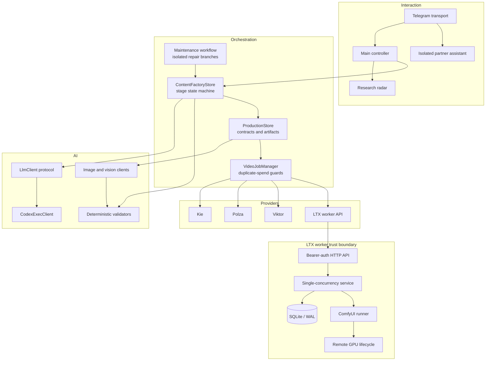

# Architecture

## System intent

AI Content Factory turns a short content idea into reviewable, durable production artifacts. The system favors controlled orchestration over unconstrained autonomy: LLMs produce semantic candidates, deterministic code validates contracts, and a human approves expensive or irreversible transitions.

## Component view

## Content state machine

`agent_platform/content_factory.py` defines the semantic stages and durable run state. A stage transitions through running, waiting-for-approval, approved, failed, or cancelled states. Artifacts are persisted before later stages consume them.

The system does not trust prose conventions alone. `agent_platform/production.py` parses machine-readable contracts for scenes, visual continuity, references, and image prompts. Missing or inconsistent contracts can be repaired, but downstream generation does not proceed with an invalid shape.

## LLM boundary

`agent_platform/llm.py` exposes a small protocol for text and image-aware chat. The current concrete production client invokes Codex CLI in an ephemeral, read-only sandbox and constructs a reduced environment rather than passing application credentials through unchanged.

Role prompts are selected by the workflow; the implementation is a controlled agentic pipeline rather than a group of unrestricted autonomous processes.

## Artifact and continuity model

The production store keeps source prompts, generated assets, hashes, selected references, scene contracts, and QA reports together under a run. Character/reference cards and scene IDs are explicit, allowing later image and video stages to verify coverage and continuity.

## Paid provider boundary

`agent_platform/video_provider.py` defines the provider protocol. `agent_platform/video_jobs.py` persists approval and submission metadata before calling providers.

Key invariants:

1. a user must approve a preview before submission;
2. a deterministic fingerprint identifies equivalent work;
3. a provider task ID is persisted when known;
4. an ambiguous POST outcome is not blindly retried;
5. polling and result download are separated from submission;
6. delivery is retriable without resubmitting paid work.

## LTX worker

The worker is a separate service because GPU lifecycle and inference have different failure and trust boundaries from the Telegram process.

- HTTP endpoints require a bearer token.
- Request bodies and source images are size/type checked.
- Jobs are stored in SQLite with WAL and unique IDs.
- A single worker reservation prevents concurrent GPU jobs.
- Startup recovery returns interrupted jobs to a reconcilable state.
- The ComfyUI workflow is pinned in `ltx_worker/assets/`.
- The remote executor uses SSH argument arrays rather than shell interpolation.
- VM shelving is attempted from cleanup paths after success or failure.

LTX is default-off in both the Telegram client and worker inference configuration.

## State ownership

| State | Storage | Intended concurrency |
|---|---|---|
| Content stages and artifacts | Atomic files under the runtime vault | Single active application process |
| Shared content queue | Dedicated file-backed store | Controlled local workflows |
| Video manager state | Durable job records | Idempotent application process |
| LTX inference jobs | SQLite/WAL | One active inference reservation |
| Credentials | Environment files outside Git | Per service |

A multi-instance deployment should move main orchestration state and Telegram update acknowledgement to a shared transactional database/queue. The public snapshot intentionally does not pretend this migration is already complete.

## Security boundaries

- Main Telegram access is fail-closed and requires an explicit allowlist.
- The partner assistant has a separate runtime and one-time pairing flow.
- Codex subprocesses use a reduced environment. Chat and inspection are read-only;
  image generation and repair receive only their dedicated writable directories/worktree.
- External providers receive only the data needed for the approved operation.
- LTX API authentication is independent from Telegram credentials.
- Production credentials, runtime state, user content, and infrastructure identifiers are not in this repository.
- `scripts/security_scan.py` and the local release gate block high-confidence credentials, personal labels, private paths, non-example IPs, and accidental personal email addresses.

## Deliberate trade-offs

The stdlib-only runtime minimizes supply-chain and deployment complexity, but it also means custom HTTP, polling, and persistence code. File-backed application state made the single-user product easy to inspect and recover; it is not presented as a horizontally scalable architecture. These are conscious MVP boundaries rather than hidden claims.
